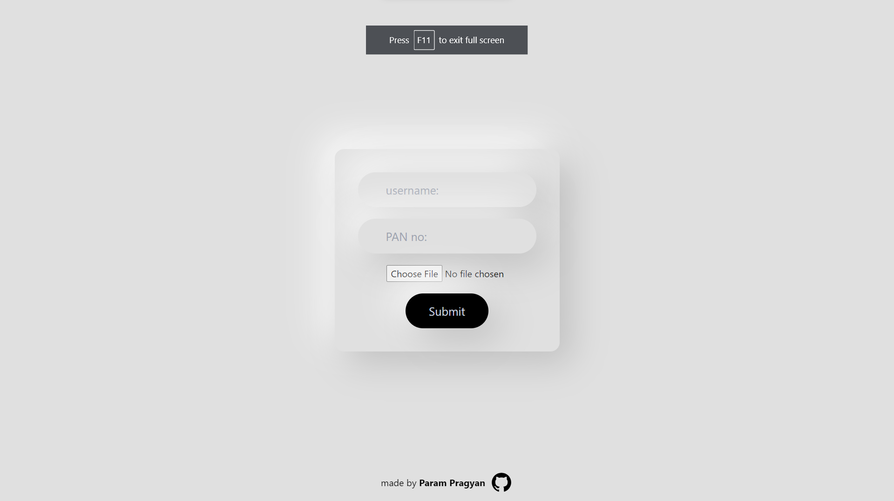
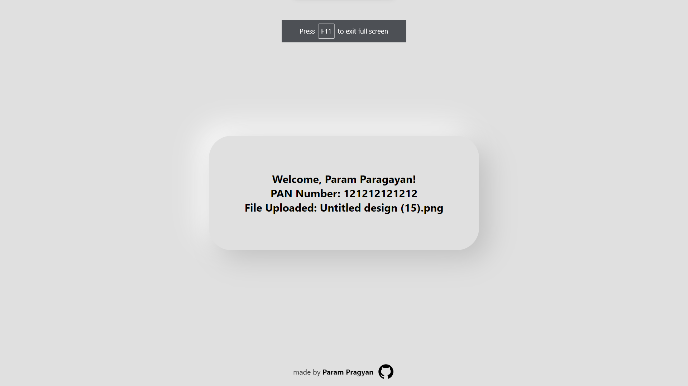

# Login-Form-ASSIGNMENT

It is a login form in which the user inputs are a follows:

1. **username**
2. **PAN number**
3. **File to upload**

It takes the inputs and stores them inside the local storage, and when the submit button is clicked, the home page is navigated and the relative data is shown.


## Screen Previews
<blockquote><b><i>login page</i></b></blockquote>


<blockquote><b><i>home page</i></b></blockquote>



live link - [here](https://login-form-assignment-xi.vercel.app/)


## Technology Used:

1. **ReactJS**
2. **TailwindCSS**

## Getting Started

1. Clone the repository to your local machine:
```bash
git clone https://github.com/ParamPragyan/Login-Form-assignment.git
```

2. Navigate to the project's directory:

```bash
cd project name
```

3. Install dependencies using 
```bash
yarn
```
<br>

## Running the App

To run the app in development mode, use the following command in the repository:

```bash
yarn dev
```

<br>
